```python
import numpy as np
from PIL import Image, ImageEnhance, ImageOps
import pandas as pd

path = '/data1/udacity/simulator/data'
img_path = path +'/IMG'
csv_file = path +'/driving_log.csv'

csv_array=pd.read_csv(csv_file)

print("Number of lines in CSV: " + str(csv_array.shape))

import matplotlib.pyplot as plt
%matplotlib inline


plt.hist(csv_array.steering, bins=50)
print("Min Steering Angle:" + str(min(csv_array.steering)))
print("Max Steering Angle:" + str(max(csv_array.steering)))
```

    Number of lines in CSV: (8036, 7)
    Min Steering Angle:-0.9426954
    Max Steering Angle:1.0


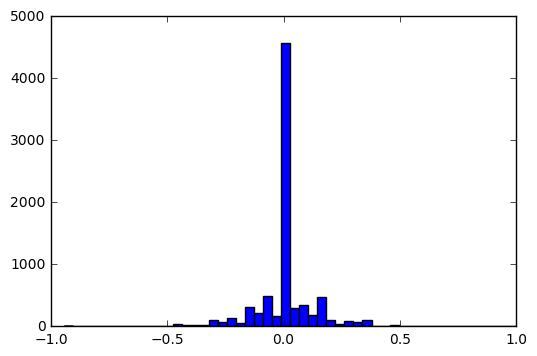


```python
# center, left, right, steering angle, throttle, break, speed

# preprocess the data

X_full_name = []
y_full_angle= []

line = csv_array.iloc[0]
  #print(line)

    
def plotCameraImages(line):
  fig, axes = plt.subplots(1, 3)
  fig.set_figwidth(10)
  fig.set_figheight(20)

  i=0
  for camera in ['left','center','right']:
    #print(i)
    axes.flat[i].imshow(Image.open(path+'/'+line[camera].decode('UTF-8').strip()))
    axes.flat[i].tick_params(labelcolor='w', top='off', bottom='off', left='off', right='off')
    if (camera=='center'):
       axes.flat[i].set_title(camera+' ' +str(line['steering']))
    else:
       axes.flat[i].set_title(camera)
        
    i=i+1
    
plotCameraImages(csv_array.iloc[0])
plotCameraImages(csv_array.iloc[1900])
plotCameraImages(csv_array[csv_array.steering < 0.26 ][csv_array.steering>0.24].iloc[4])
    

```

    /home/alans/anaconda2/envs/cancer_tutorial_tf/lib/python2.7/site-packages/ipykernel/__main__.py:31: UserWarning: Boolean Series key will be reindexed to match DataFrame index.


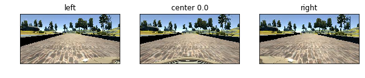


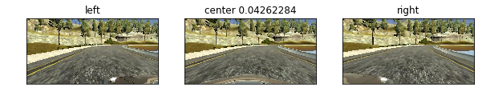


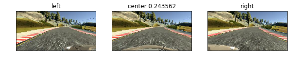


```python
csv_array.head()
```


<div>
<table border="1" class="dataframe">
  <thead>
    <tr style="text-align: right;">
      <th></th>
      <th>center</th>
      <th>left</th>
      <th>right</th>
      <th>steering</th>
      <th>throttle</th>
      <th>brake</th>
      <th>speed</th>
    </tr>
  </thead>
  <tbody>
    <tr>
      <th>0</th>
      <td>IMG/center_2016_12_01_13_30_48_287.jpg</td>
      <td>IMG/left_2016_12_01_13_30_48_287.jpg</td>
      <td>IMG/right_2016_12_01_13_30_48_287.jpg</td>
      <td>0.0</td>
      <td>0.0</td>
      <td>0.0</td>
      <td>22.148290</td>
    </tr>
    <tr>
      <th>1</th>
      <td>IMG/center_2016_12_01_13_30_48_404.jpg</td>
      <td>IMG/left_2016_12_01_13_30_48_404.jpg</td>
      <td>IMG/right_2016_12_01_13_30_48_404.jpg</td>
      <td>0.0</td>
      <td>0.0</td>
      <td>0.0</td>
      <td>21.879630</td>
    </tr>
    <tr>
      <th>2</th>
      <td>IMG/center_2016_12_01_13_31_12_937.jpg</td>
      <td>IMG/left_2016_12_01_13_31_12_937.jpg</td>
      <td>IMG/right_2016_12_01_13_31_12_937.jpg</td>
      <td>0.0</td>
      <td>0.0</td>
      <td>0.0</td>
      <td>1.453011</td>
    </tr>
    <tr>
      <th>3</th>
      <td>IMG/center_2016_12_01_13_31_13_037.jpg</td>
      <td>IMG/left_2016_12_01_13_31_13_037.jpg</td>
      <td>IMG/right_2016_12_01_13_31_13_037.jpg</td>
      <td>0.0</td>
      <td>0.0</td>
      <td>0.0</td>
      <td>1.438419</td>
    </tr>
    <tr>
      <th>4</th>
      <td>IMG/center_2016_12_01_13_31_13_177.jpg</td>
      <td>IMG/left_2016_12_01_13_31_13_177.jpg</td>
      <td>IMG/right_2016_12_01_13_31_13_177.jpg</td>
      <td>0.0</td>
      <td>0.0</td>
      <td>0.0</td>
      <td>1.418236</td>
    </tr>
  </tbody>
</table>
</div>


Load our data and plot out some images to see how they are transformed, make sure code works correctly

    Test: 
      loadTraining  
      processImage


```python
import data
import cv2


xs,ys = data.loadTraining()

def displayRowOfImages(filename):
    img=[]
    img.append( np.array(Image.open(filename)))
    img.append(data.processImage(filename))
    img.append( data.processImage(filename) )


    fig, axes = plt.subplots(1, 3)
    fig.set_figwidth(10)
    fig.set_figheight(20)

    i=0
    for camera in ['raw','processed1','processed2']:
        print(img[i].shape)
        axes.flat[i].imshow(img[i])
        axes.flat[i].tick_params(labelcolor='w', top='off', bottom='off', left='off', right='off')
        axes.flat[i].set_title(camera)
        i=i+1
    plt.show()
    
displayRowOfImages(xs[0])
displayRowOfImages(xs[1])
displayRowOfImages(xs[2])
displayRowOfImages(xs[3])

```

    (160, 320, 3)
    (66, 200, 3)
    (66, 200, 3)


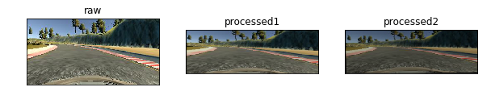


    (160, 320, 3)
    (66, 200, 3)
    (66, 200, 3)


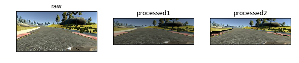


    (160, 320, 3)
    (66, 200, 3)
    (66, 200, 3)


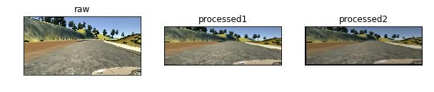


    (160, 320, 3)
    (66, 200, 3)
    (66, 200, 3)


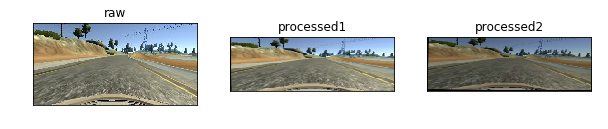


    Test 
       augment_brightness_camera_images


```python
print('original')
filename=xs[0]
img3 = np.array(Image.open(filename))
plt.imshow(img3)
plt.show()
print('brightness')
filename=xs[0]
img3 = np.array(Image.open(filename))
img3 = data.augment_brightness_camera_images(img3)
plt.imshow(img3)
plt.show()
print('brightness')
img3 = np.array(Image.open(filename))
img3 = data.augment_brightness_camera_images(img3)
plt.imshow(img3)
plt.show()
```

    original


    brightness


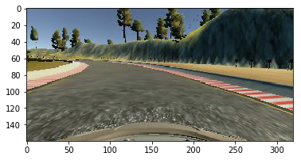


    brightness


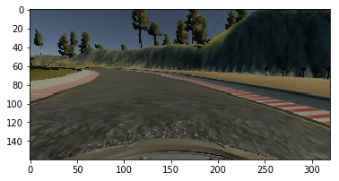


    Test
             cropImage


```python
print('original')
filename=xs[0]
img3 = np.array(Image.open(filename))
plt.imshow(img3)
plt.show()
print('crop')
filename=xs[0]
img3 = np.array(Image.open(filename))
img3 = data.cropImage(img3)
plt.imshow(img3)
plt.show()
```

    original


    crop


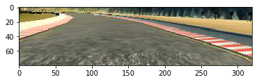


    test
        rotateAndScaleImage


```python
print('original')
filename=xs[0]
img3 = np.array(Image.open(filename))
plt.imshow(img3)
plt.show()
print('rotateAndScale')
filename=xs[0]
img3 = np.array(Image.open(filename))
img3 = data.rotateAndScaleImage(img3)
plt.imshow(img3)
plt.show()
```

    original


    rotateAndScale


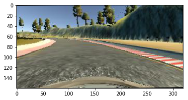


     test
            translateImage


```python
print('original')
filename=xs[0]
img3 = np.array(Image.open(filename))
plt.imshow(img3)
plt.show()
print('translateImage')
filename=xs[0]
img3 = np.array(Image.open(filename))
img3 = data.translateImage(img3)
plt.imshow(img3)
plt.show()
```

    original


    translateImage


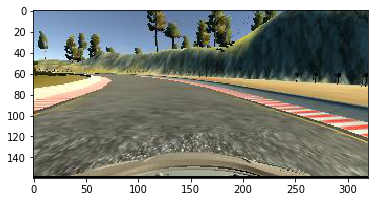


```python
print("original distribution")
plt.hist(csv_array.steering, bins=50)
plt.show()
print("new distribution")
out=plt.hist(ys, bins=50)
plt.show()
print("overlay")
bins = 50
plt.hist(csv_array.steering, bins, alpha=0.5, label='before')
plt.hist(ys, bins, alpha=0.5, label='after')
plt.legend(loc='upper right')
plt.show()
```

    original distribution


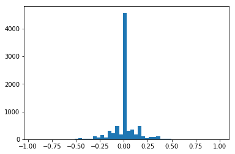


    new distribution


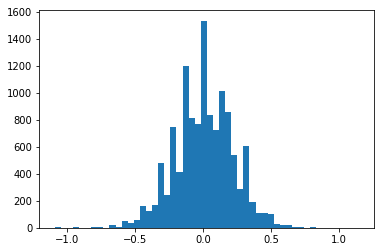


    overlay


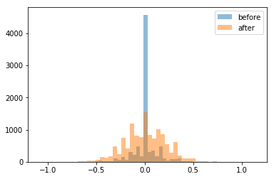


```python
import pickle

history = pickle.load(open("history.p","rb"))
print(history)
#http://machinelearningmastery.com/display-deep-learning-model-training-history-in-keras/
# summarize history for loss
plt.plot(history['loss'])
plt.plot(history['val_loss'])
plt.title('model loss')
plt.ylabel('loss')
plt.xlabel('epoch')
plt.legend(['loss', 'val_loss'], loc='upper left')
plt.show()

```

    {'val_loss': [0.018404757827580796, 0.017217977097845619, 0.016923269466931318, 0.016685742597848732, 0.016591834837974134, 0.015960397151965778, 0.015917173237067747, 0.015689060517978783, 0.01576835371022145, 0.015587212999758446, 0.015367965584821751, 0.015667771216593712, 0.016161610495483401, 0.015297604469463096, 0.016399787463978938, 0.015453848871496858, 0.015318657574451559, 0.015699964646621632, 0.015748150314341111, 0.015152621171335234], 'loss': [0.032728429269045595, 0.021674223272129894, 0.020952650643885136, 0.019362537255510688, 0.019144715834409, 0.018465346172451973, 0.01843427637591958, 0.018113174997270106, 0.01755004432052374, 0.017194986995309591, 0.017121432758867742, 0.017060810765251518, 0.016604097709059715, 0.015966608310118317, 0.016038478249683977, 0.015924241002649067, 0.015979975154623391, 0.01533959568478167, 0.015537455435842276, 0.015003452757373453]}


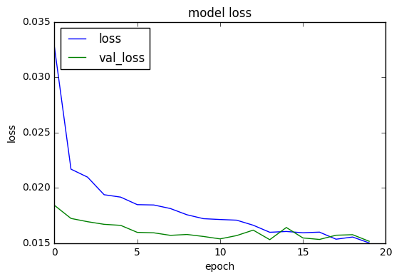

