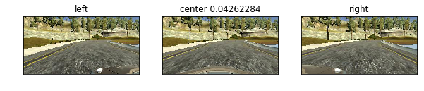
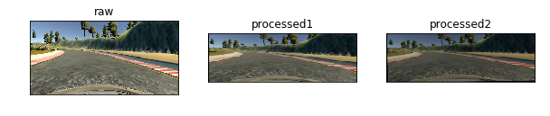
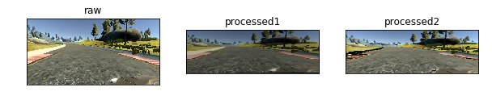
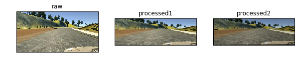
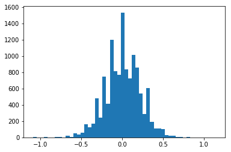

#**Behavioral Cloning** 
---

**Behavrioal Cloning Project**

The goals / steps of this project are the following:
* Use the simulator to collect data of good driving behavior
* Build, a convolution neural network in Keras that predicts steering angles from images
* Train and validate the model with a training and validation set
* Test that the model successfully drives around track one without leaving the road
* Summarize the results with a written report


[//]: # (Image References)

[image1]: ./carmodel.png "Model Visualization"
[image2]: ./examples/placeholder.png "Grayscaling"
[image3]: ./examples/placeholder_small.png "Recovery Image"
[image4]: ./examples/placeholder_small.png "Recovery Image"
[image5]: ./examples/placeholder_small.png "Recovery Image"
[image6]: ./examples/placeholder_small.png "Normal Image"
[image7]: ./examples/placeholder_small.png "Flipped Image"

## Rubric Points
###Here I will consider the [rubric points](https://review.udacity.com/#!/rubrics/432/view) individually and describe how I addressed each point in my implementation.  

---
###Files Submitted & Code Quality

####1. Submission includes all required files and can be used to run the simulator in autonomous mode

My project includes the following files:
* model.py containing the script to create and train the model
* drive.py for driving the car in autonomous mode
* model.h5 containing a trained convolution neural network 
* writeup_report.md summarizing the results
* data.py contains functions to load training data, augment images, and the generator
* DataExplorer.ipynb imports data.py and is used to visualize and debug the image augmentation pipeline


####2. Submssion includes functional code
Using the Udacity provided simulator and my drive.py file, the car can be driven autonomously around the track by executing 
```sh
python drive.py model.h5
```

####3. Submssion code is usable and readable

The model.py file contains the code for training and saving the convolution neural network. The file shows the pipeline I used for training and validating the model, and it contains comments to explain how the code works.

###Model Architecture and Training Strategy

####1. An appropriate model arcthiecture has been employed

My model is based on a variant of the NVIDIA paper. I started with http://github.com/SullyChen/Autopilot-TensorFlow/ and https://github.com/jacobgil/keras-steering-angle-visualizations
I added DropOut (I tried 33% and 50%), and converted the code so that it stuck to Keras - removing some TensorFlow dependencies that were in that implementation.  

The network starts with a Lambda layer to normalize the image data.  It converts the image values from 0-255 to +/-1. 

The model then includes 5 Convolution layers.  The first two are 5x5 filter sizes with depths 24, 36, 48. Then the filters are reduced to 3x3 at depths of 64.  Following the Convolution layers are a series of Fully connected layers - 1164, 100, 50, 10.  All of these layers are activated with RELU to add nonlinearity. 

The last fully connected layer outputs one value with a tanh activation. It represents the steering angle from -1 to 1.


####2. Attempts to reduce overfitting in the model

The model contains dropout layers in order to reduce overfitting

The model was trained and validated on different data sets to ensure that the model was not overfitting. The model was tested by running it through the simulator and ensuring that the vehicle could stay on the track.

####3. Model parameter tuning

The model used an adam optimizer, so the learning rate was not tuned manually 

####4. Appropriate training data

I spent a good amount of time collecting training data. I ended up only using the udacity provided training data. Mostly this was because I was able to get good results with it.  My training data was in a slightly different format, and I didn't get around to converting it and merging it all into one set. 


###Model Architecture and Training Strategy

####1. Solution Design Approach

Before starting the self driving car ND I tried to work on Challenge 2. During this time, I came to the realization that I needed to take the ND more than ever. I didn't make it far at all.  However, I did download a bunch of other people's models, train them with their data and run their visualizers.  Sully Chen's stood out as one of the best, and fairly simple. 

When tackling this project I first started by downloading and trying to adapt models from Sully Chen (an NVIDIA style model), Comma AI, as well as a few of the solutions to Challenge 2.  

I feel like I wasted a lot of time, because I didn't build a good debugging pipeline.  It turned out that most of my time was spent tweaking with parameters (epoch, batch size, samples per epoch, etc). However, when I finally built a nice python notebook (included) to visualize the stages of my augmentation pipeline - I realized that I wasn't really augmenting the images well, I was mostly breaking them and putting weird noise in.  I had two major problems -- not realizing that cv2 image open was BGR not RGB, and I was using a grayscale image brightness algorithm instead of a color one (converting to HSV and back).  Through this process I also built a version with grayscale that worked quite nicely.  It was more of a challenge to get the color one working though, I just couldn't understand why it didn't work until I looked at each image.

When things didn't work well the validation error often didn't improve, or would stay exactly the same.  

After feedback from the Traffic sign project, I tried implementing EarlyStopping, and using the built in model saver. After reading a bunch of posts on the forums, people tended to say that the validation error was less important than the results in the simulator. Therefore I save all of the results, and test the ones that seem to have low validation, before the validation just flattens. I also have a graph of the validation results in the python notebook.

In order not to overfit - there is a combination of a heavy dropout, as well as lots of image augmentation. Each time a batch of images is created, I randomly modify the brightness, rotate, scale, and translate the images.  See more detail below, about augmentation, left/right selection and normalizing the histogram.

The hardest part of the track was the parking lot after the bridge. The car kept wanting to go into the parking lot. After I added the randomized brightness - it seems much better at avoiding the parking lot.

At the end of the process, the vehicle is able to drive autonomously around the track without leaving the road.

The car does well on the second track, but doesn't seem to complete the track. After one training run it did complete the track. I am not sure why it doesn't anymore. I am tempted to change the validation dataset to 0% (use all the data as training data) and see if it improves.

####2. Final Model Architecture

The final model architecture (model.py lines 18-24) consisted of a convolution neural network with the following layers and layer sizes ...

Here is a visualization of the architecture (note: visualizing the architecture is optional according to the project rubric)


![alt text][image1]

####3. Creation of the Training Set & Training Process

Creating my own dataset (which I didn't use)

I used a logitech steering wheel that I had left over from my playstation 2. It worked nicely to control the car and give smooth steering angles. I drove straight, and unfortunately kept bumping into the sides of the road. I wrote some pygame code to visualize the video. I recorded the "in and out" numbers and wrote some code to splice the file into a new file, so that I could use the training data. 

Because it was faster, I ended up in parallel training the model using only the udacity data. It worked well, but started to go into the parking lot after the bridge. I thought that I needed to collect more training data. I was planning on adding a bunch of samples driving near the parking lot. However, before I got to do that, I saw a post about modifying the brightness. Once I added that code, it drove all the way around. It would take another few hours to pull in my own training data, I haven't had the time to do that.  I have been more interested in playing with the parameters and cleaning up the code.


Exploring the data from the udacity sample

```
    Number of lines in CSV: (8036, 7)
    Min Steering Angle:-0.9426954
    Max Steering Angle:1.0
```
The udacity datset has 8036 samples, but most of them are straight:


Here are a few random samples from the udacity dataset. The left/center/right is shown along with the steering angle of the center image.





The following are four example images, that have been augmented twice each:










Here is the data pipeline:

The 8036 samples are loaded, and 90% of the straight samples are removed.  Left and Right images are added to the dataset with a steering offset or +/- 0.15  - I tried a few values for this offset.

The resulting dataset looks like this:
    original distribution


    new distribution





    overlay


The generator creates a batch sized list of images/steering angles by looping through and randomly picking one record from the training dataset. After opening the image, it then calls the augmentation function which:
 1. adjusts the brightness
 2. rotates and scales the image  +/- 1 degree rotation, +/- 1.02 scale (randomly)
 3. translates the image +/- 2 pixels randomly
 4. adjusts the size to 200x66
 
 An Adam optomizer was chosen. I have a large video card, so I tried a batch size of 256, and 100*256 samples per epoch. 20 epochs were fine. From the graph below, it seems like 10 is a good epoch to use.
 
 


